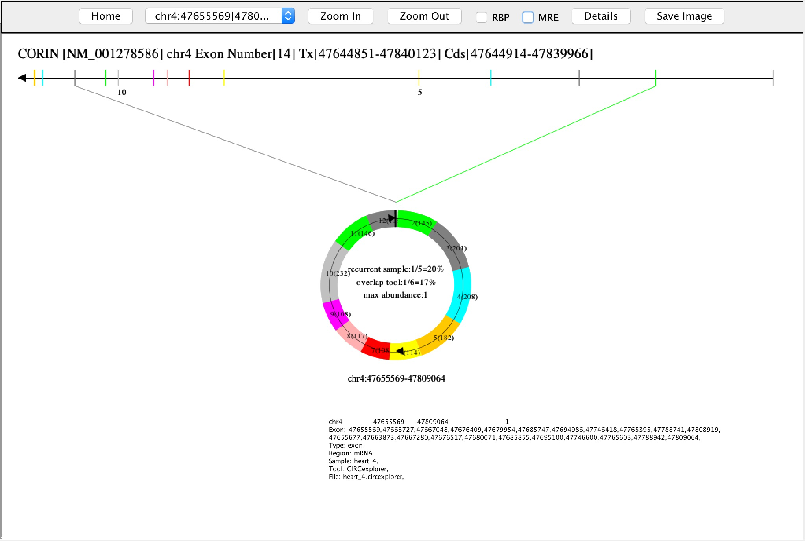
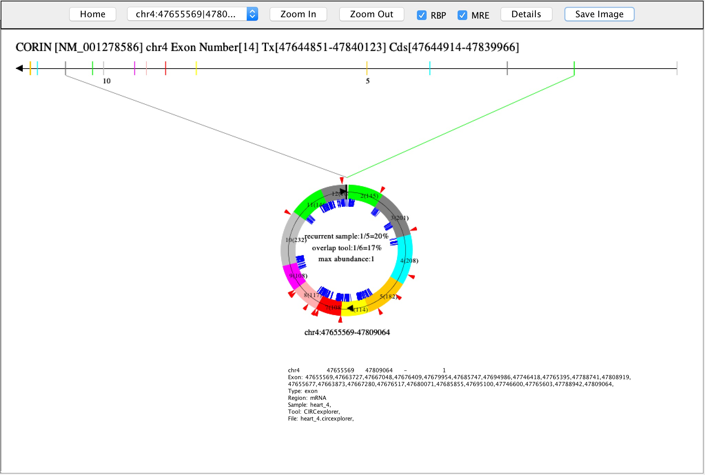
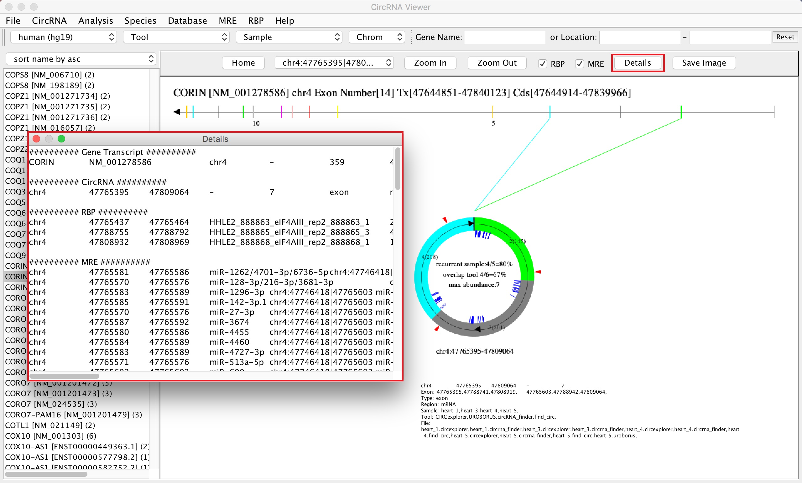
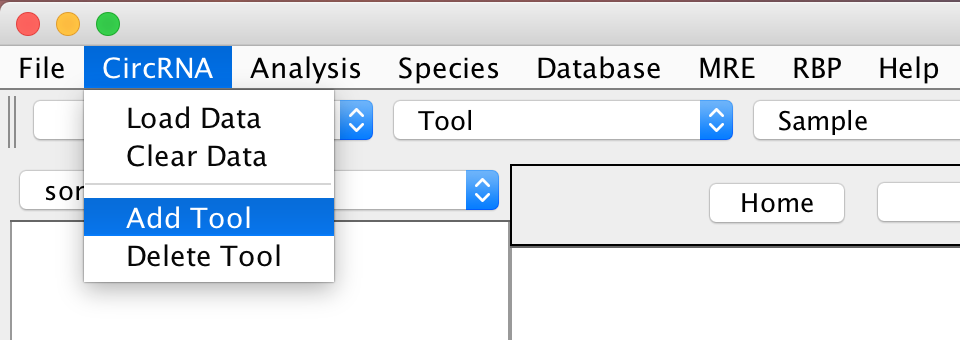
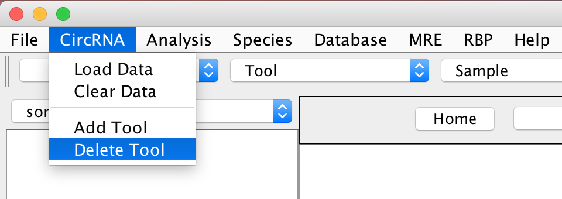
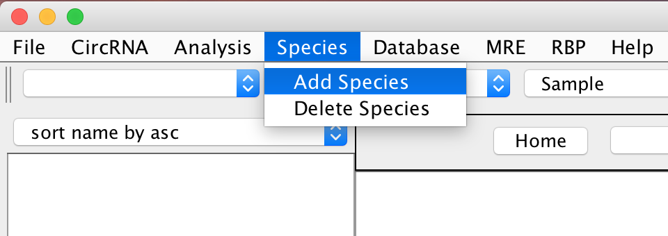
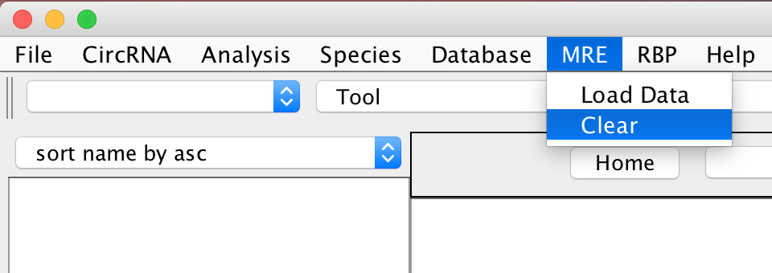

**1.	BEST PRACTISE**  
> **1.1.	Basic Feature: CircRNAs Visualization**  
> 1.1.1	Java Virtual Machine should be installed before running this program. See **7 HOW TO INSTALL JAVA VIRTUAL MACHINE**.  
> 1.1.2	Download and decompress "CircView.tar.gz" from http://github.com/GeneFeng/CircView/blob/master/CircView.tar.gz  
> Double click CircView.jar to launch the program.  
> 1.1.3	Download and decompress circRNA data from https://github.com/GeneFeng/CircView/blob/master/testdata/human.tar.gz    
> 1.1.4	Click “CircRNA”->”Load Data” to load circRNA files according species and tools.  
>   
> 1.1.5	Click gene transcript name on left panel to view the image of the circRNAs.  
>   
> 1.1.6	Gene transcript can be searched by name or location.  
> 1.1.7 Click one "Circle" to view details of each circRNA.  
>   
> 1.1.8	Detailed information and image of circRNAs can be saved for further use.  
> 1.1.9	Click "Analysis"->"Comparison" to make a comparison between circRNAs with different samples and/or tools.  
>   
> Click "Save as" button to export results to a ".csv" file for further use.  

> **1.2.	Advanced Feature: MRE and RBP sites Visualization on CircRNAs**  
> 1.2.1	MySQL need to be installed, see **8 HOW TO INSTALL MYSQL**.  
> 1.2.2	Restart CircView.jar  
> 1.2.3	Download and decompress MRE data from http://gb.whu.edu.cn/CircView/testdata/mre_human.tar.gz   
> 1.2.4	Click “MRE”->”Load Data” to load MRE file.  
> 1.2.5	Download and decompress RBP data from http://gb.whu.edu.cn/CircView/testdata/rbp_human.tar.gz  
> 1.2.6	Click “RBP”->”Load Data” to load RBP file.  
> 1.2.7	Load circRNAs data, see 1.1.4  
> 1.2.8	Check MRE or RBP to add MRE sites (blue lines) or RBP sites (red triangles) to CircRNAs.  
>   
> 1.2.9 Click "Details" button to see detailed information of MRE and RBP sites.  
>   
  
**2. HOW TO GET CIRCVIEW AND TEST DATA**  
> Download CircView application from http://github.com/GeneFeng/CircView/blob/master/CircView.tar.gz  
> Download circRNAs test data from https://github.com/GeneFeng/CircView/blob/master/testdata   
> Download MRE data from http://gb.whu.edu.cn/CircView/testdata/mre_human.tar.gz  
> Download RBP data from http://gb.whu.edu.cn/CircView/testdata/rbp_human.tar.gz   
  
**3. HOW TO MANAGE CIRCRNAS DATA**  
> **3.1.	CircRNAs Identification Tool Management**  
> CircView integrates 6 CircRNAs identification tools (CIRCexplorer, circRNA_finder, CIRI, find_circ, Mapsplice, and UROBORUB) by default.  
> Users can add or delete tool by using menu “CircRNA”->”Add Tool” or “CircRNA”->”Delete Tool”.  
> &nbsp;&nbsp;&nbsp;&nbsp;  
>   
>**3.2.	CircRNAs Data Management**  
> CircView can load CircRNAs data directly from output of default 6 CircRNAs identification tools.  
> Users can also import circRNAs identified by other tools with six tab delimited columns, including chromosome, start point, end point, running number/name, junction reads and strand.  
> &nbsp;&nbsp;&nbsp;&nbsp;  

**4. HOW TO MANAGE SPECIES DATA**  
> CircView provides 7 species (Human (hg38), Human (hg19), Mouse (mm10), Mouse (mm9), Zebrafish (zv9), Fly (dm6), C.elegans (ce10)) by default.  
>   
> Users can also add or delete species annotation data with compatible format by using menu “Species”->”Add Species” or “Species”->”Delete Species”.  
> &nbsp;&nbsp;&nbsp;&nbsp;  
  
**5.	HOW TO MANAGE MRE AND RBP DATA**   
> CircRNAs mainly function as sponges for the regulatory elements, such as miRNA respond elements (MREs) and RNA binding proteins (RBPs). CircView provides advanced features to display regulatory elements.  
> This module requires the users to install MySQL locally, see **8 HOW TO INSTALL MYSQL**. Users can load and display the MRE data identified by TargetScan (http://targetscan.org/) and/or the RBP data identified by starBase (http://starbase.sysu.edu.cn/) or any other tool. The format requires five tab delimited columns, including chromosome, start site, end site, MRE/RBP name and description.  
> Load MRE or RBP file will create table and deposit data into MySQL database, and Clear MRE or RBP will remove data from the database. As the data are persistent, users should not load the same data for more than once.  
> &nbsp;&nbsp;&nbsp;&nbsp;  
  
**6.	HOW TO FIND CIRCRNA DATABASES**  
> CircView provides links to some circRNA databases (CircBase, Circ2Traits, TSCD, CircNet, circRNADb).  
>   
  
**7.	HOW TO INSTALL JAVA VIRTUAL MACHINE**  
> Java Virtual Machine need be installed before running this program. Simply access http://www.java.com, download Java, and install it.  
  
**8.	HOW TO INSTALL MYSQL**  
> **8.1.	For Windows**  
> 8.1.1	Download and decompress MySQL Installation file from http://gb.whu.edu.cn/CircView/MySQL/mysql_windows.tar.gz  
> 8.1.2	Double click “NDP46-KB3045557-x86-x64-AllOS-ENU.exe” to install .NET Framework.  
> 8.1.3	Double click “mysql-installer-community-5.7.16.0.msi” to install MySQL. Please create password “12345” for user root during installation.  
>  
> **8.2.	 For Mac OS**  
> 8.2.1	Download MySQL Installation file from http://gb.whu.edu.cn/CircView/MySQL/mysql-5.7.17-macos10.12-x86_64.dmg  
> 8.2.2	Double click “mysql-5.7.17-macos10.12-x86_64.dmg” to install MySQL. Please create password “12345” for user root during installation.  
  