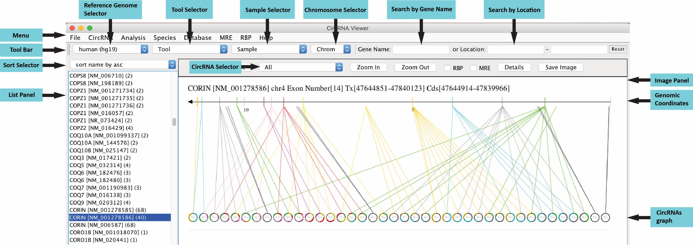
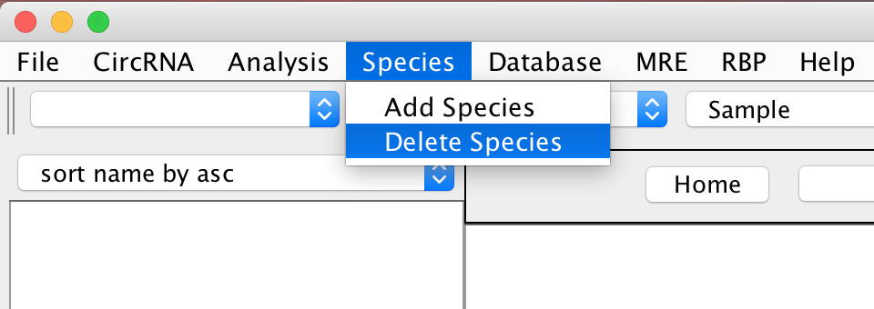
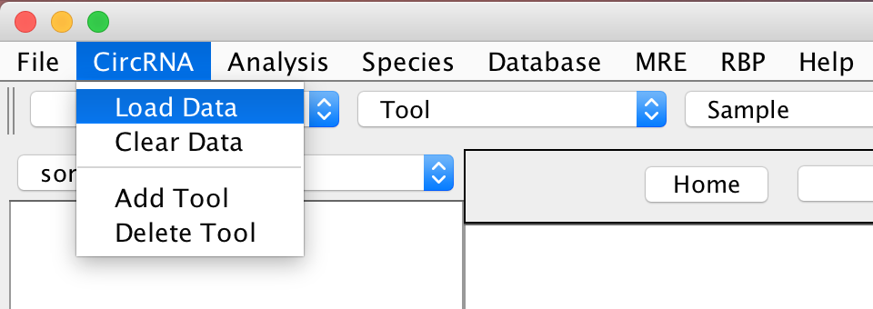

**1. HOW TO GET CIRCVIEW AND TEST DATA**  
> Download CircView application from http://github.com/GeneFeng/CircView/blob/master/CircView.jar  
> Download gene annotation and circRNAs data from https://github.com/GeneFeng/CircView/blob/master/testdata   
> Download MRE data from http://gb.whu.edu.cn/CircView/testdata/mre_human.tar.gz  
> Download RBP data from http://gb.whu.edu.cn/CircView/testdata/rbp_human.tar.gz 
  
**2.	BEST PRACTISE**  
> **2.1.	Basic Feature: CircRNAs Visualization**  
> 2.1.1	Java Virtual Machine should be installed before running this program. See 6 HOW TO INSTALL JAVA VIRTUAL MACHINE.  
> 2.1.2	Double click CircView.jar to launch the program.  
> 2.1.3	Download species data from https://github.com/GeneFeng/CircView/blob/master/testdata/gene_annotation.tar.gz and decompress it.  
> 2.1.4	Click “Species”->”Load Data” to load the “Human_hg19.txt” file.  
> 2.1.5	Download circRNA data from https://github.com/GeneFeng/CircView/blob/master/testdata/human.tar.gz and decompress it.    
> 2.1.6	Click “CircRNA”->”Load Data” to load the circRNA files according species and algorithm.  
>   
> 2.1.7	Click the gene transcript name on the left panel to see the image of the circRNAs.  
>   
> 2.1.8	Gene transcript can be searched by its name or location.  
> 2.1.9 Click one "Circle" to see details of one circRNA.  
>   
> 2.1.10	CircRNAs detail information and image can be saved for further use.  
> 2.1.11	Click "Analysis"->"Comparison" to make a comparison between circRNAs with different samples and algorithms.  
>   

>  
> **2.2.	Advanced Feature: RBP and MRE sites Visualization on CircRNAs**  
> 2.2.1	Install MySQL firstly, see 7 HOW TO INSTALL MYSQL  
> 2.2.2	Restart the CircView.jar  
> 2.2.3	Download MRE data from http://gb.whu.edu.cn/CircView/testdata/mre_human.tar.gz  
> 2.2.4	Decompress mre_human.tar.gz  
> 2.2.5	Click “MRE”->”Load Data” to load MRE file.  
> 2.2.6	Download RBP data from http://gb.whu.edu.cn/CircView/testdata/rbp_human.tar.gz  
> 2.2.7	Decompress rbp_human.tar.gz  
> 2.2.8	Click “RBP”->”Load Data” to load RBP file.  
> 2.2.9	Load Species and circRNAs, just like it do in 2.1.4 and 2.1.6  
> 2.2.10	Check the RBP or MRE to add RBP sites (the red triangles) or MRE sites (the blue lines) to CircRNAs  
>   
  
  
**3. HOW TO MANAGE SPECIES DATA**  
> **3.1.	Species Name Management**  
> The CircView integrates 5 species (Human (hg19), Mouse (mm9), Zebrafish (zv9), Fly (dm6)), C.elegans (ce10) by default.  
> The users can also add or delete species by using menu “Species”->”Add Species” or “Species”->”Delete Species”.  
> &nbsp;&nbsp;&nbsp;&nbsp;  
>   
> **3.2.	Species Data Management**  
> The users can load all species gene annotation data have the compatible format with the test annotation files.  
> The user can also clear species data for saving memory.  
> &nbsp;&nbsp;&nbsp;&nbsp;  
  
**4. HOW TO MANAGE CIRCRNAS DATA**  
> **4.1.	CircRNAs Identification Software Management**  
> The CircView integrates 6 CircRNAs identification software ( CIRCexplorer, circRNA_finder, CIRI, find_circ, Mapsplice, and UROBORUB) by default.  
> The Users can add or delete software by using menu “CircRNA”->”Add Tool” or “CircRNA”->”Delete Tool”.  
> &nbsp;&nbsp;&nbsp;&nbsp;  
>   
>**4.2.	CircRNAs Data Management**  
> CircView can load CircRNAs data directly from the output of the default 6 CircRNAs Identification softwares.  
> The user can also import circRNAs identified by other tools with the compatible format with six tab delimited columns, including chromosome, start point, end point, running number/name, junction reads and strand.  
>  
  
**5.	HOW TO MANAGE MRE AND RBP DATA**  
> **5.1.	MRE and RBP Data Management**  
> CircRNAs mainly function as sponges for the regulatory elements, such as miRNA respond elements (MREs) and RNA binding proteins (RBPs). CircView provides advanced features to display regulatory elements.  
> This module requires the users to install MySQL locally, see **7 HOW TO INSTALL MYSQL**. Then the users can load and display the MRE data identified by TargetScan (http://targetscan.org/) and/or the RBP data identified by starBase (http://starbase.sysu.edu.cn/) with the compatible format with five tab delimited columns, including chromosome, start site, end site, MRE/RBP name and description. Other regulatory elements with the same format are also compatible.  
> Load MRE or RBP file will create table and deposit data into MySQL database, and Clear MRE or RBP will remove data from the database. As the data are persistent, same data should not load more than once.  
> &nbsp;&nbsp;&nbsp;&nbsp;  
  
**6.	HOW TO INSTALL JAVA VIRTUAL MACHINE**  
> Java Virtual Machine should be installed before running this program. Simply access http://www.java.com, download Java, and install it.  
  
**7.	HOW TO INSTALL MYSQL**  
> **7.1.	For Windows**  
> 7.1.1	Download MySQL Installation file from http://gb.whu.edu.cn/CircView/MySQL/mysql_windows.tar.gz  
> 7.1.2	Decompress mysql_windows.tar.gz  
> 7.1.3	Double click “NDP46-KB3045557-x86-x64-AllOS-ENU.exe” to install .NET Framework.  
> 7.1.4	Double click “mysql-installer-community-5.7.16.0.msi” to install MySQL. Be sure to create password “12345” for user root during installation.  
>  
> **7.2.	 For Mac OS**  
> 7.2.1	Download MySQL Installation file from http://gb.whu.edu.cn/CircView/MySQL/mysql-5.7.17-macos10.12-x86_64.dmg  
> 7.2.2	Double click “mysql-5.7.17-macos10.12-x86_64.dmg” to install MySQL. Be sure to create password “12345” for user root during installation.  
  